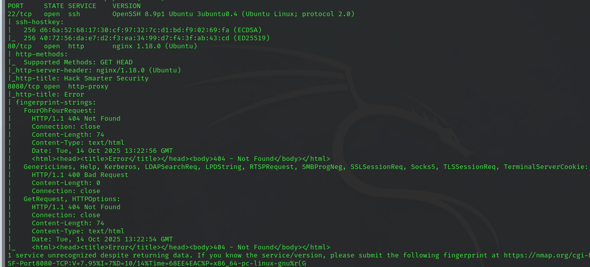
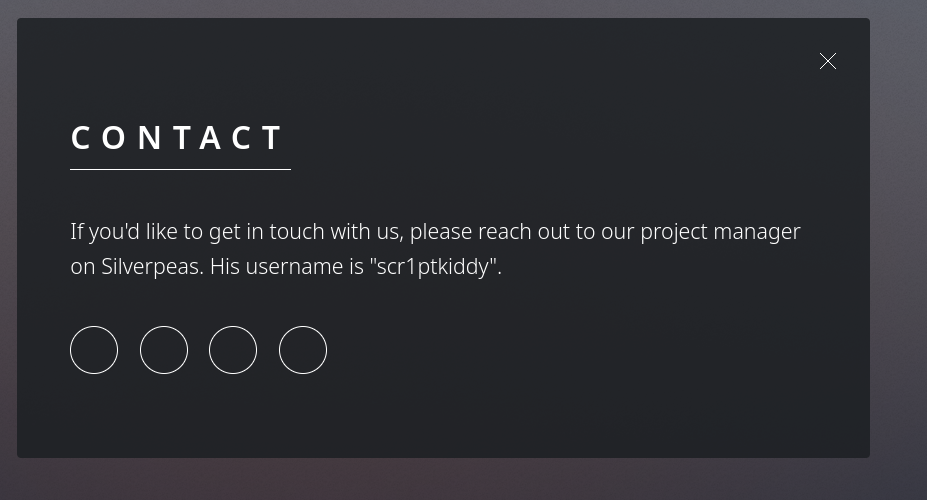
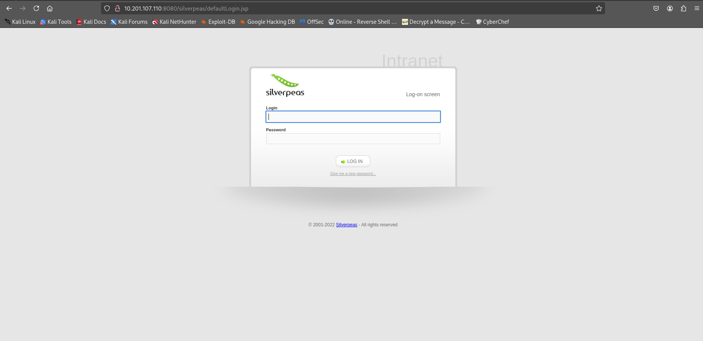
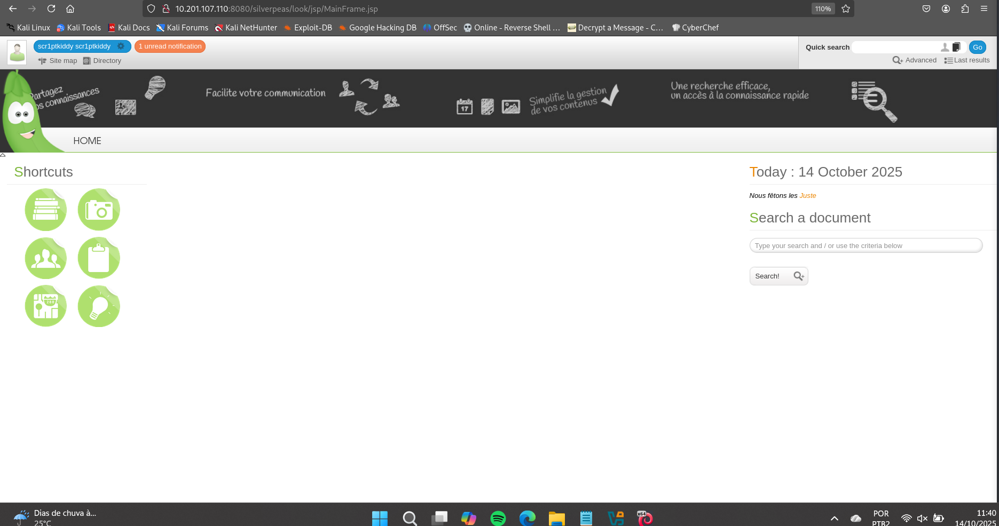
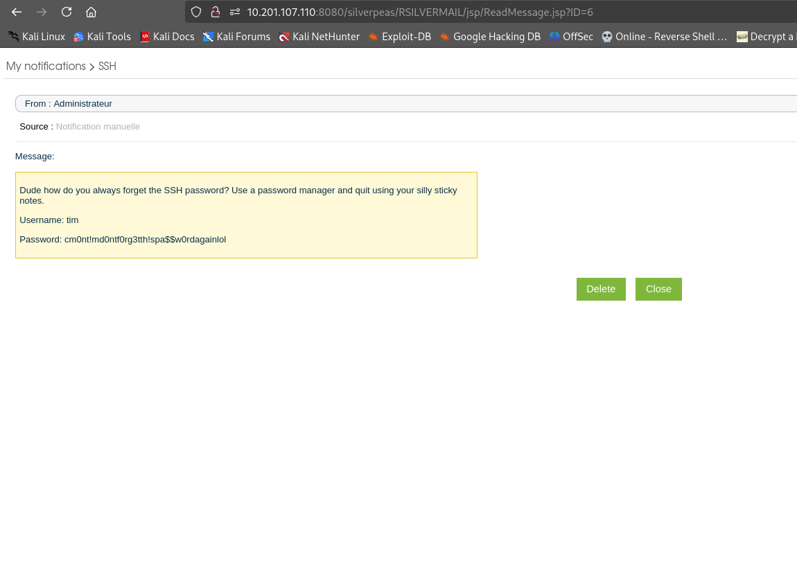
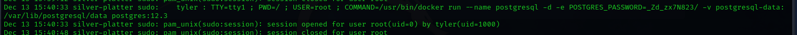
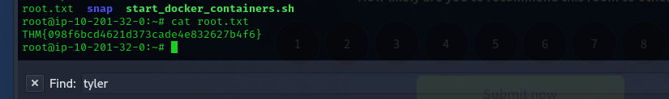

# Silver Platter CTF Write-up

## Synopsis
Silver Platter CTF is a machine running vulnerable HTTP and SSH services. By discovering a hidden directory and user, it's possible to obtain the necessary credentials to log in via SSH and find a way to escalate privileges within the machine.

## Enumeration

The initial reconnaissance was done with an `nmap` scan to identify open ports and services on the machine.

```bash
> nmap -sV -sC -v <IP_MAQUINA>
```

<div align="center">

<p align="center"> Result of the Nmap scan.<b> </b></p>
</div>

The scan showed ports 22 (SSH), 80 (HTTP), and 8080 (HTTP) were open.

Accessing port 80, we found the main website. After exploring the site, we found a reference to `silverpeas` and a user named `scr1ptkiddy`.

<div align="center">

<p align="center"> User found on the website.<b> </b></p>
</div>

## Vulnerability and Exploitation
After some searching, we realized that "silverpeas" referred to a directory on the web server running on port `8080`. This led us to a login page. All we needed was the password for the user we had already found.

<div align="center">

<p align="center"> Login page at the /silverpeas directory.<b> </b></p>
</div>

To find the password, we used the `cewl` tool to create a wordlist based on words from the website, and then used `hydra` to perform a brute-force attack.

```bash
> cewl <URL> -d 4 -w wordlist.txt
```
```bash
> hydra -l <user> -P word.txt <IP_MAQUINA> -s 8080 http-post-form "/silverpeas/AuthenticationServlet/:Login=^USER^&Password=^PASS^&DomainId=0:F=Login or password incorrect"
```
With this, we obtained the user's password and were able to log into the page.

<div align="center">

<p align="center"> Site found after logging in.<b> </b></p>
</div>

Inside the site, after some exploration, we noticed that the notification pop-up allowed us to access old notification IDs, which led us to a username and password for SSH.

<div align="center">

<p align="center"> Notification with the user and password for SSH.<b> </b></p>
</div>

## Initial Access
Our starting point was accessing the machine with the user `tim`. A quick scan of his home directory rewarded us with the first flag, located in `user.txt`. The next step was to escalate our privileges.

After running `sudo -l`, we noticed that the user tim did not have root access, so we needed to find another way to escalate privileges. We knew of the existence of another user, `tyler`, but his password was a mystery. The key to moving forward was in the logs, where we discovered this user's password and were able to log in as him via SSH.

<div align="center">

<p align="center"> Password obtained from the logs.<b> </b></p>
</div>

## Privilege Escalation
Armed with the new pair of credentials, we were able to connect via SSH as tyler. From this point, running `sudo -l` revealed that the user tyler had permission to run commands as root. A simple `sudo` su solved our privilege escalation problem.

The final login as root gave us full access to the machine. With this, we captured the final flag and completed the CTF.

<div align="center">

<p align="center"> The root flag.<b> </b></p>
</div>
