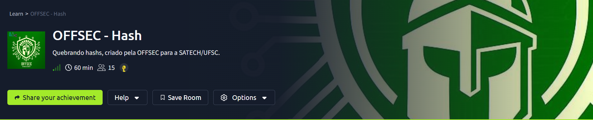
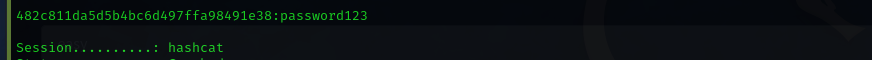
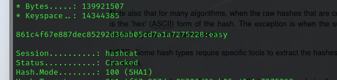
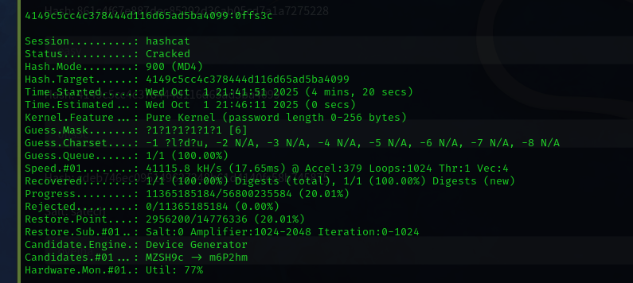
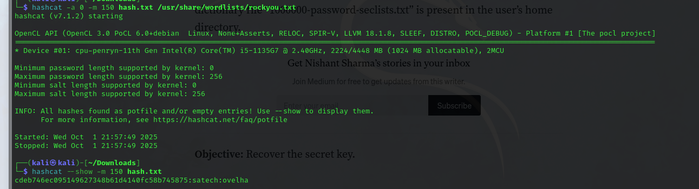
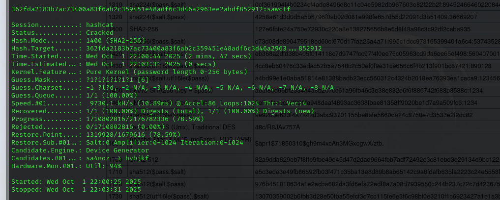

# OFFSEC Hash Write-up

## Synopsis
A hash-cracking CTF created by OFFSEC for SATECH/UFSC. In this CTF, the objective is to identify the type of each hash and perform the cracking using Hashcat, ultimately obtaining the link to the next challenge.

## Hash Cracking

### Hash 1: MD5
The first hash was `482c811da5d5b4bc6d497ffa98491e38`. Using the `hashid` tool, it was identified as an MD5 hash. The following command was used to crack it against the `rockyou.txt` wordlist.

```bash
> hashcat -a 0 -m 0 hash.txt /usr/share/wordlists/rockyou.txt
```
The cracked password was `password123`.

<div align="center">

<p align="center"> Result for the MD5 hash.<b> </b></p>
</div>

Hash 2: SHA-1
The second hash was `861c4f67e887dec85292d36ab05cd7a1a7275228`. It was identified as SHA-1.

```bash
> hashcat -a 0 -m 100 hash.txt /usr/share/wordlists/rockyou.txt
```
The cracked password was `easy`.

<div align="center">

<p align="center"> Result for the SHA-1 hash.<b> </b></p>
</div>

Hash 3: MD4 (Brute Force)
The third hash, `4149c5cc4c378444d116d65ad5ba4099`, was identified as MD4. Unlike the previous ones, this required a brute-force attack.

```bash
> hashcat -a 3 -m 900 -1 ?l?d?u hash.txt ?1?1?1?1?1?1
```
The cracked password was `0ffs3c`.

<div align="center">

<p align="center"> Result for the MD4 hash.<b> </b></p>
</div>

Hash 4: HMAC-SHA1
The fourth hash, `cdeb746ec095149627348b61d4140fc58b745875`, was identified as HMAC-SHA1.

```bash
> hashcat -a 0 -m 150 hash.txt /usr/share/wordlists/rockyou.txt
```
The cracked password was `satech`.

<div align="center">

<p align="center"> Result for the HMAC-SHA1 hash.<b> </b></p>
</div>

Hash 5: SHA2-256 (Brute Force)
The final hash, `362fda2183b7ac73400a83f6ab2c359451e48adf6c3d46a2963ee2abdf852912`, was identified as SHA2-256 and also required a brute-force attack.

```bash
> hashcat -a 3 -m 1400 -1 ?l?d?u hash.txt ?1?1?1?1?1?1
```
The cracked password was `sawctf`.

<div align="center">

<p align="center"> Result for the SHA2-256 hash.<b> </b></p>
</div>

By cracking the final hash, we found the link to the next CTF. And so ends the OFFSEC Hash challenge from the SATECH 2025 CTF.
