# Prometheus CTF Write-up

## Synopsis
CTF inspired by cyberpunk themes, chosen by OFFSEC for the SATECH/UFSC 2025. Inside this CTF, a machine is running that is vulnerable to SQL Injection, allowing a user and password to be obtained from the database, making it possible to connect to the shell and escalate privileges from a misconfiguration of sudo permissions.

## Enumeration

The initial reconnaissance was done with an `nmap` scan to identify open ports and services on the machine `10.10.144.113`.

```bash
> nmap -sV -sC -v <IP_MAQUINA>
```
<div align="center">
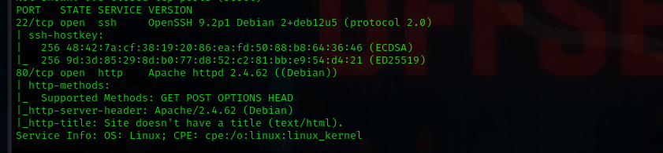
<p align="center"> Result of the Nmap scan.<b> </b></p>
</div>

The scan showed ports 22 (SSH) and 80 (HTTP) were open.

Accessing port 80, we found the main http page. A second page, `index2.php`, was found, through the command:
```bash
> gobuster dir-u <IP_MAQUINA>-w /usr/share/wordlists/dirbuster/directory-list-2.3-medium.txt-x php,txt,html
```

<div align="center">
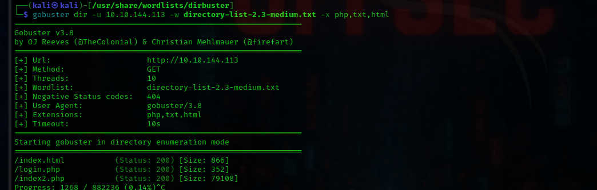
<p align="center"> Gobuster Result.<b> </b></p>
</div> 

Upon accessing the hidden directory, we came across the following page in a cyberpunk style.
<div align="center">
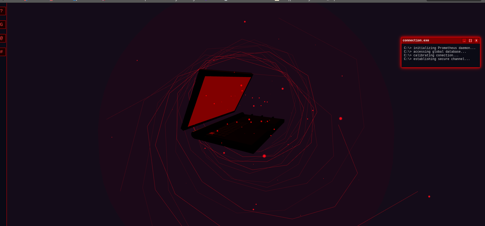
<p align="center"> index2.php page.<b> </b></p>
</div>  

When analyzing the page's source code, we found, in the middle of the code, a hexadecimal message that, when decoded, answers one of the questions asked in the challenge. This analysis also showed a new directory that, by all indications, is a login page.

<div align="center">
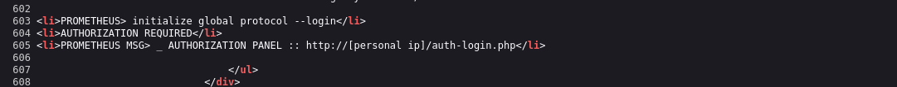
<p align="center"> New directory.<b> </b></p>
</div>  


## Vulnerability and Exploitation
By injecting the command `' OR '1'='1'` into the user field of the new tab found, an SQL error was returned, confirming an SQL Injection vulnerability.

<div align="center">
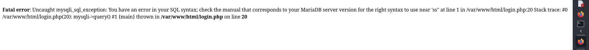
<p align="center">SQL error confirming the vulnerability.<b> </b></p>
</div>  


To exploit this vulnerability, I used the `sqlmap` tool to try to extract some extra information that could help with logging in via ssh.

```bash
> sqlmap -u "http://<IP_MAQUINA>/auth-login.php" --forms --crawl=1 --dump
```

In this command, `--forms` instructs sqlmap to look for HTML forms on the target URL . when we find this form, sqlmap automatically identifies the vulnerable fields. The `--crawl=1` activates the site's crawling functionality, meaning sqlmap will follow the links found on the target page to discover other potential injection points. The `=1` defines the crawling depth, so it will analyze the initial page and all the links it finds on it. The `--dump` flag is the flag that actually acts, it tells the tool what to do after finding the vulnerability. It specifically instructs sqlmap to extract all the content of the database tables, and that is exactly where we get our login and our password to access port 22.


<div align="center">
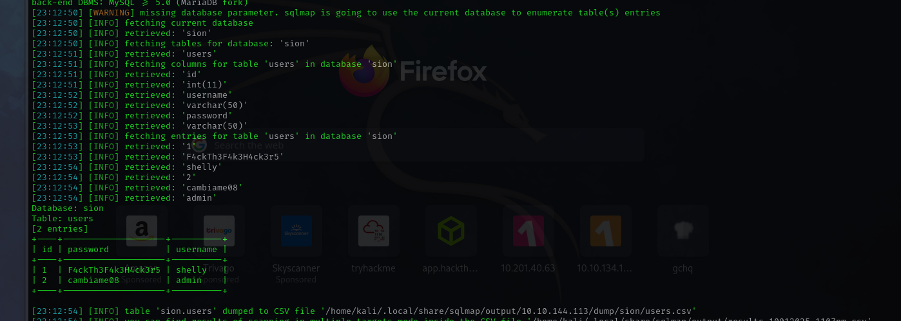
<p align="center">Sqlmap extracting users and password hashes.<b> </b></p>
</div>  

`sqlmap` obtained the hashes for the user shelly.

## Initial Access
With the password and user we can log in to the system through ssh.

```bash
> ssh shelly@<IP_MAQUINA>
```
<div align="center">
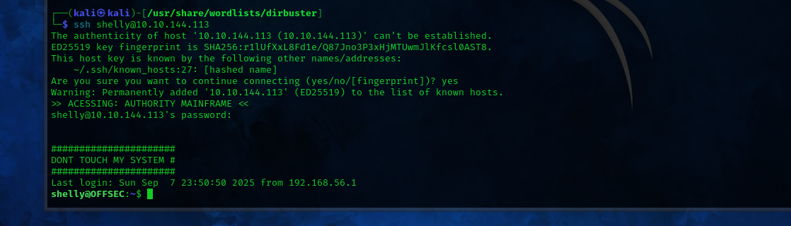
<p align="center">I'm sorry Shelly, but now it's too late.<b> </b></p>
</div>  

Once inside the system, just do a cat to get the user's flag.

<div align="center">
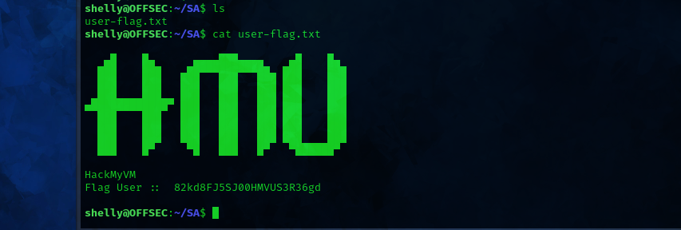
<p align="center"> Content of the user-flag.txt file.<b> </b></p>
</div>  

## Privilege Escalation
The `sudo -l` command revealed that the user shelly could execute the `find` command as sudo. Consulting GTFObins, a method was found to escalate privileges.

<div align="center">
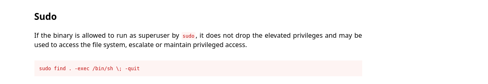
<p align="center"> Command for privilege escalation with find.<b> </b></p>
</div>

The command was executed on the target machine, granting a root shell.

```bash
> sudo find . -exec /bin/sh \; -quit
```

<div align="center">
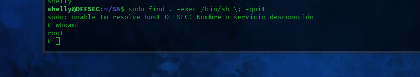
<p align="center"> Execution of the command and obtaining root access.<b> </b></p>
</div>

With root access, the final flag was found inside an image file, and was extracted with the strings command.

<div align="center">
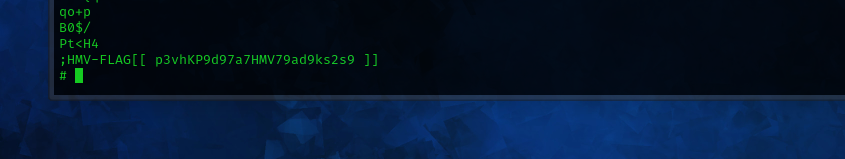
<p align="center"> Root flag extracted from the file.<b> </b></p>
</div>

And so ends the Pr0m3th3us CTF from the satech 2025 CTF.
