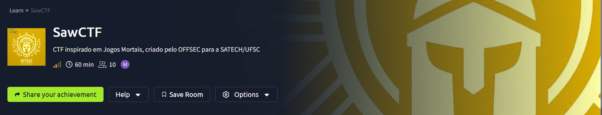
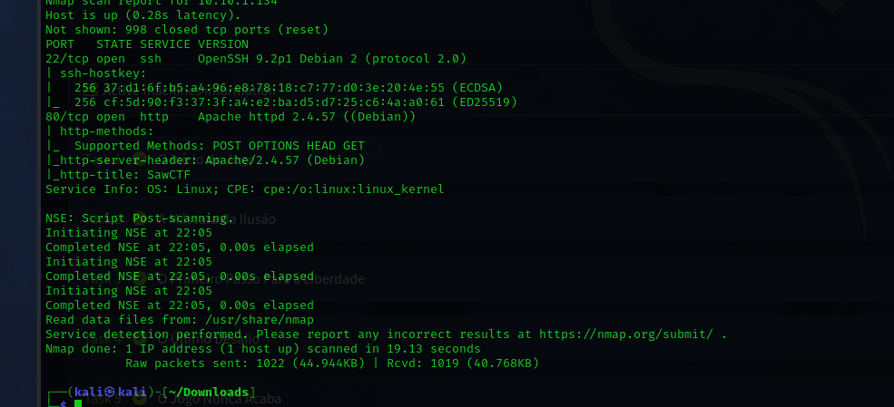
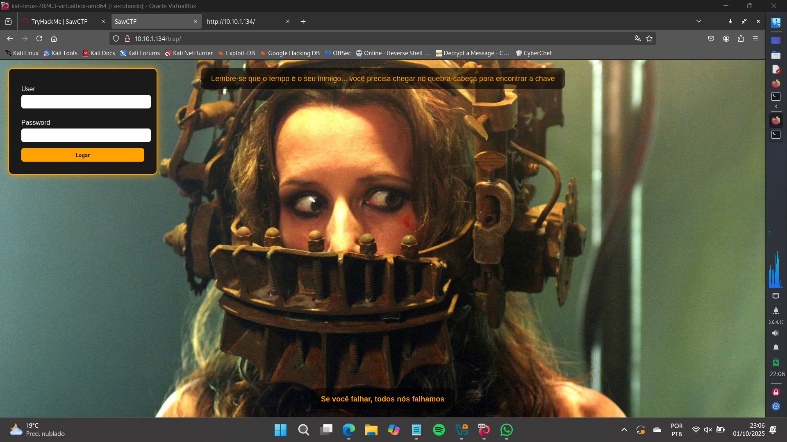
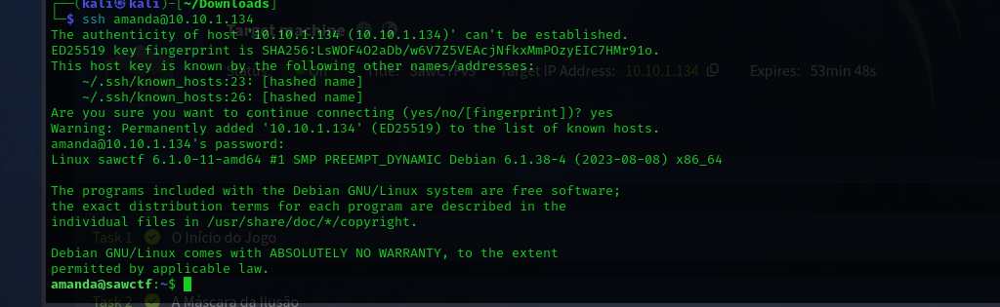
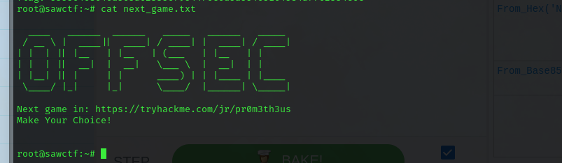

# SawCTF Write-up

## Synopsis
[cite_start]CTF inspired by the movie Saw, created by OFFSEC for SATECH/UFSC 2025[cite: 245]. [cite_start]This CTF involves a machine running HTTP and SSH services with vulnerabilities[cite: 246]. [cite_start]The solution primarily relies on source code analysis and hash cracking to obtain a user and password[cite: 246].

## Enumeration
The initial reconnaissance was done with an `nmap` scan to identify open ports and services on the machine.

```bash
> nmap -sV -sC -v <IP_MAQUINA>
```
<div align="center">

<p align="center"> Result of the Nmap scan.<b> </b></p>
</div>

The scan showed ports 22 (SSH) and 80 (HTTP) were open. Accessing port 80, we found the main http page. An analysis of the source code revealed a hidden directory: `/trap`.


<div align="center">

<p align="center"> Login page found at the hidden directory.<b> </b></p>
</div>

Accessing the `/trap` directory led to a login page. Analyzing this new page's source code revealed another directory, `/trap/jigsaw`. In this new location, a password in Hexadecimal and a username in Morse code were found, which revealed the credentials for the user "amanda".


## Initial Access
With the decoded password and username, we could log in to the system via ssh.

```bash
> ssh amanda@<IP_MAQUINA>
```
<div align="center">

<p align="center">Successful SSH login as user amanda.<b> </b></p>
</div>

Once inside the system as the user amanda, a quick scan of her home directory revealed the first flag, located in `user.txt`. The next step was to escalate privileges.


## Privilege Escalation
We knew of the existence of another user, john, but his password was unknown. By accessing the URL `http://<IP_MAQUINA>/trap` as the logged-in user amanda, we analyzed the page's source code, and there, john's password was revealed.


With the new credentials for john, we reconnected via SSH. From there, we exploited system vulnerabilities to escalate our privileges, which granted us access to the root password.


The final login as root gave us full access to the machine. With this, we not only captured the final flag but also found a link that led to the next challenge.


<div align="center">

<p align="center"> The root flag and the URL for the next challenge.<b> </b></p>
</div>

And so ends the Saw CTF from the SATECH 2025 CTF
